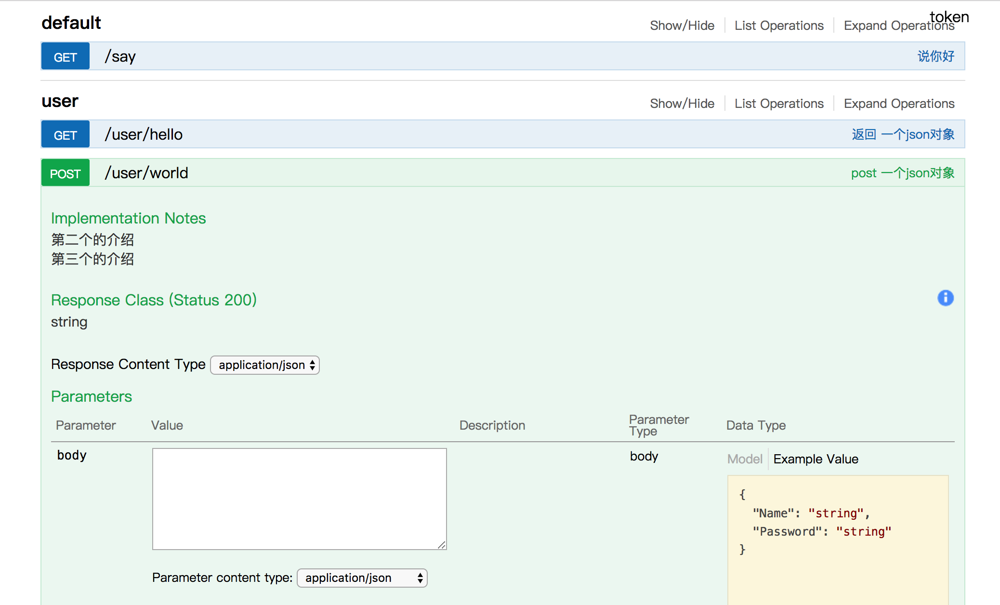

# gev

一个基于 [gin](https://github.com/gin-gonic/gin) 的 restful 框架

``` bash
# 安装
go get github.com/inu1255/gev
```

### 功能

- 直接将普通的 struct 或 func 转换成接口
- 自动生成swagger接口文档
- 可以通过注释修改接口 relativePath,httpMethod 以及为swagger添加说明

### 示例

``` go
package main

import "github.com/inu1255/gev"

type User struct {
    Name     string
    Password string
}

// 只有返回 (xxx, error) 的函数会被路由
func (this *User) Other(s string) string {
    return s
}

// @desc 返回 一个json对象
func (this *User) Hello(s string) (*User, error) {
    user := &User{
        Name:     "hello",
        Password: s,
    }
    return user, nil
}

// 包含一个 struct或者pointer 时使用 POST
// @desc post 一个json对象
// @desc 第二个的介绍
// @desc 第三个的介绍
func (this *User) World(user *User) (string, error) {
    return user.Name + " " + user.Password, nil
}

// @desc 说你好
// @path /say
func SayHello(name string) (string, error) {
    return "hello " + name, nil
}

func main() {
    app := gev.New()

    user := new(User)
    maker := gev.NewRouteMaker()
    //  将实例映射成两个接口
    //  /user/hello
    //  /user/world
    maker.AddRoute(user)
    // 将函数映射成
    // /say          ps: 默认是 /say/hello 通过33行的 `@path /say` 修改
    maker.AddRoute(SayHello)
    maker.RouteAll(app)

    app.Swagger("/api")
    app.Run(":8017")
}
```

### 运行

``` bash
go run main.go
```
访问 [http://localhost:8017/api/](http://localhost:8017/api/)

